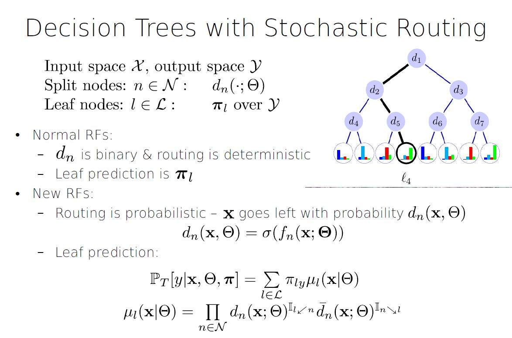
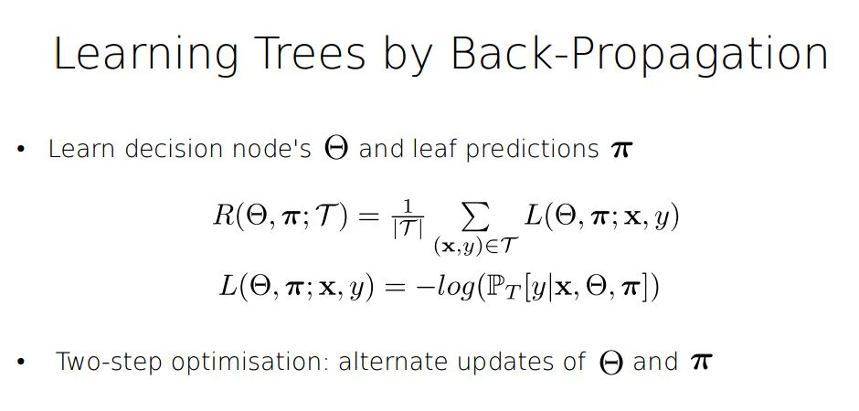
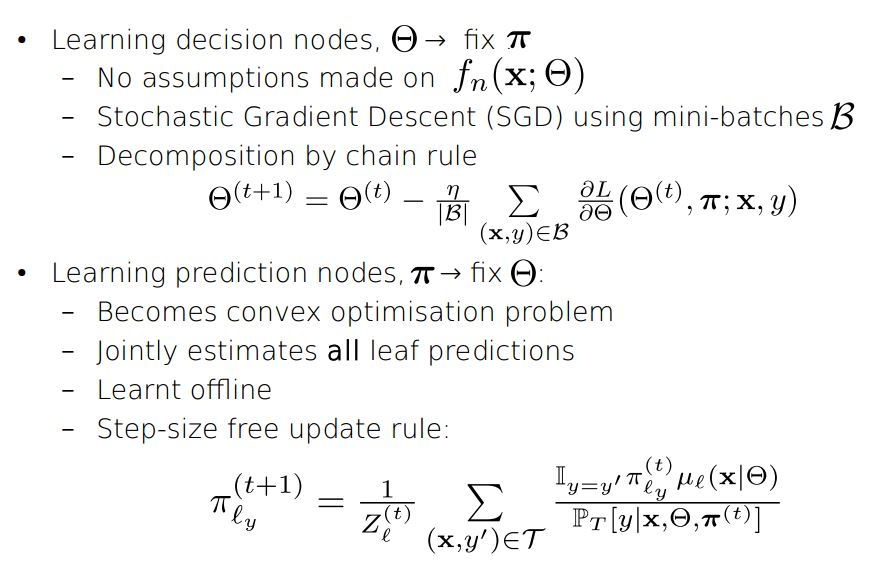
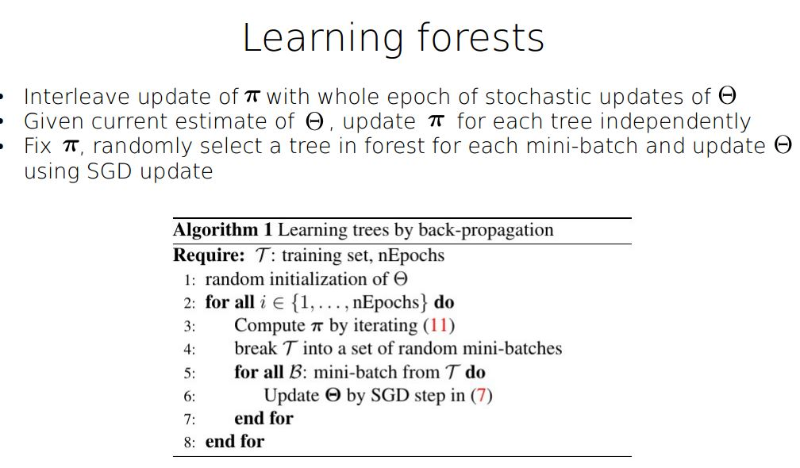
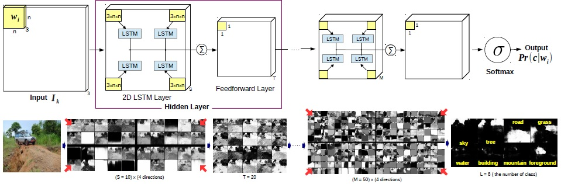
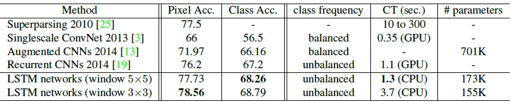
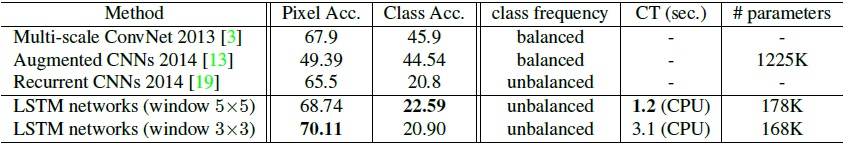
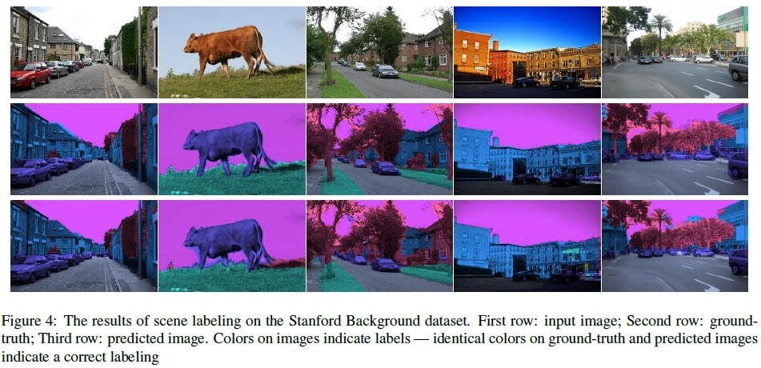

**Learning a Probabilistic Latent Space of Object Shapes via 3D Generative-Adversarial Modeling. NIPS 2017**

# Learning a Probabilistic Latent Space of Object Shapes via 3D Generative-Adversarial Modeling. NIPS 2017

[Access link](http://3dgan.csail.mit.edu/)

**Other related resource not presented**
- Fundamental paper on GAN [Access link] (https://arxiv.org/pdf/1406.2661v1.pdf)
- you tube video of From Facebook AI research - Soumith Chintala - Adversarial Networks [Access link](https://www.youtube.com/watch?v=QPkb5VcgXAM&t=257s)

*Presented by Pooran Singh Negi*

**Summary:** Papers propose **3D- Generative Adversial Network(3D-GAN)**
for 3D object creation (using sample from a probablistic space) and
classification task. This latent space can also be inferred as shown in 2D image to 3D image generation( **3D-VAE-GAN section**). A VAE is used along with
3D-VAN for this setup. Proposed method shows state of the art and above
performance against supervised and unsupervied method. Another interesting
work done in paper is showing latent space arithmetics where objects can
be manipulated in latent space to build new novel and realistic objects.
This is simialr to word to vector of  Mikolov but is more impressive
as manipuation is done in latent space not the actual learned representation space.

- **Main architecture**

credit:: All the figure realted to this papers are from ppt and paper from
Jiajun Wu*, Chengkai Zhang*, Tianfan Xue, William T. Freeman, and Joshua B. Tenenbaum

Network: 

- Loss functions
  + 3D-GAN
  
  + 3D-VAE-GAN
  

**Deep Neural Decision Forests. ICCV 2015**

# Deep Neural Decision Forests. ICCV 2015
[Access link](http://www.cv-foundation.org/openaccess/content_iccv_2015/papers/Kontschieder_Deep_Neural_Decision_ICCV_2015_paper.pdf)

[Slides](http://www.robots.ox.ac.uk/~tvg/publications/talks/deepNeuralDecisionForests.pdf)

*Presented by Ali Mollahosseini*

**Summary:** 
This paper proposes a Deep Neural Decision Forests
that unifies classification trees with the representation
learning functionality known from deep convolutional
networks, by training them in an end-to-end manner. 
Experimental result on benchmark machine
learning datasets like MNIST and ImageNet shows superior results when compared to state-of-the-art
deep models. Top5-Errors of only 7.84%/6.38% on ImageNet validation data when integrating
our forests in a single-crop, single/seven model
GoogLeNet architecture, respectively. Thus, even without
any form of training data set augmentation we are improving
on the 6.67% error obtained by the best GoogLeNet architecture
(7 models, 144 crops)

Random forests  has been empirically
demonstrated to outperform most state-of-the-art
learners when it comes to handling high dimensional data
problems, they are inherently able to deal with multiclass
problems, are easily distributable on parallel hardware
architectures while being considered to be close to an ideal
learner

[Slides on Random Forest](http://www.cs.ubc.ca/~nando/540-2013/lectures/l9.pdf)

[Video on Random Forest](https://www.youtube.com/watch?v=3kYujfDgmNk)

Deep learning approaches is can learn feature representations together with
their classifiers. This paper introduces  a stochastic, differentiable, and therefore backpropagation
compatible version of decision trees, guiding
the representation learning in lower layers of deep convolutional
networks.

**Scene Labeling with LSTM Recurrent Neural Networks. CVPR 2015**

# Scene Labeling with LSTM Recurrent Neural Networks. CVPR 2015
[Access Link](http://www.cv-foundation.org/openaccess/content_cvpr_2015/papers/Byeon_Scene_Labeling_With_2015_CVPR_paper.pdf)

Presented by *Behzad Hasani*

**Summary:**

This paper addresses the problem of pixel-level segmentation and classification of scene images with an entirelym learning-based approach using Long Short Term Memory (LSTM) recurrent neural networks, which are commonly used for sequence classification. They investigate two-dimensional (2D) LSTM networks for natural scene images taking into account the complex spatial dependencies of labels. Prior methods generally have required separate classification and image segmentation stages and/or pre- and post-processing. In this approach, classification, segmentation, and context integration are all carried out by 2D LSTM networks, allowing texture and spatial model parameters to be learned within a single model. The networks efficiently capture local and global contextual information over raw RGB values and adapt well for complex scene images. This approach, which has a much lower computational complexity than prior methods, achieved state-ofthe- art performance over the Stanford Background and the SIFT Flow datasets. In fact, if no pre- or post-processing is applied, LSTM networks outperform other state-of-the-art approaches. Hence, only with a **single-core** CPU, the running time of our approach is equivalent or better than the compared state-of-the-art approaches which use a GPU. Finally, the networks’ ability to visualize feature maps from each layer supports the hypothesis that LSTM networks are overall suited for image processing tasks.

[What is LSTM?](http://colah.github.io/posts/2015-08-Understanding-LSTMs/)

**Proposed Network Architecture:**

**Results:**

**Examples:**

**Farzaneh Presentation goes here**

