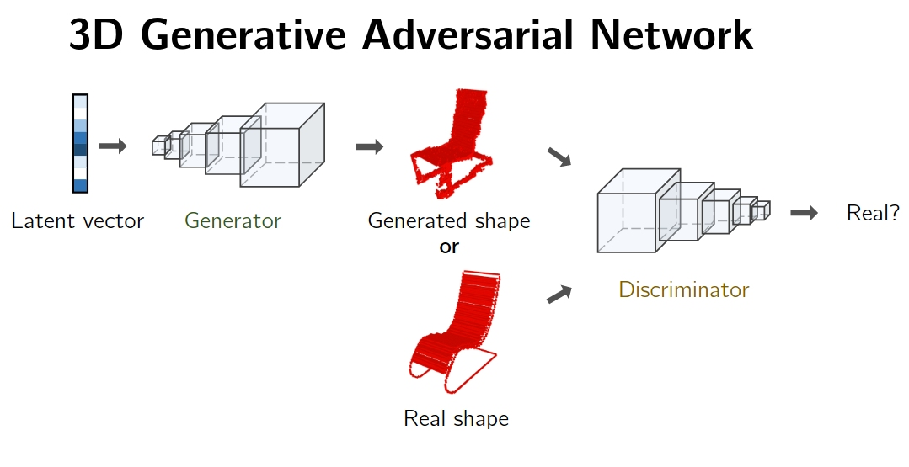
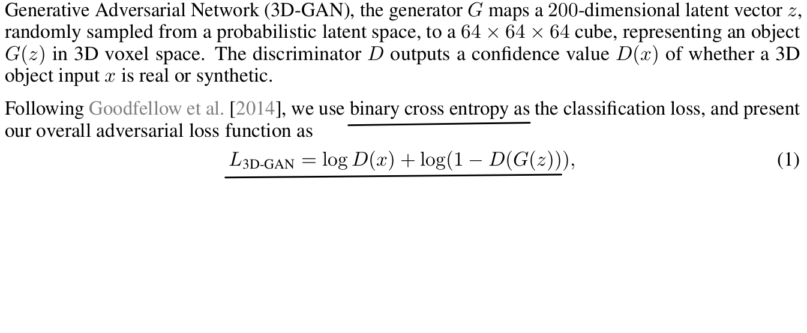
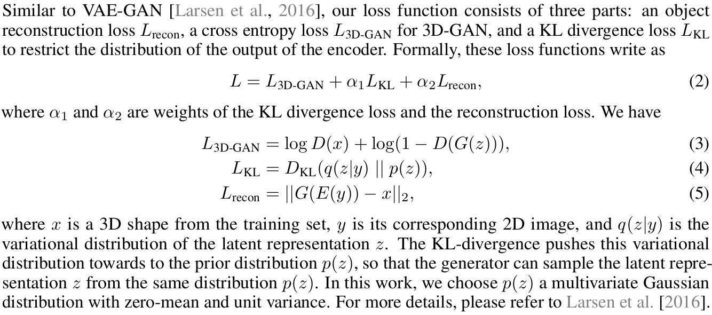

- [Learning a Probabilistic Latent Space of Object Shapes 
via 3D Generative-Adversarial Modeling. NIPS 2017](http://3dgan.csail.mit.edu/)

**Summary:** Papers propose **3D- Generative Adversial Network(3D-GAN)**
for 3D object creation using sample of a probablistic space and classification
task. This latent space acan also be inferred as shown in 2D image to 3D image
generation as shown in **3D-VAE-GAN section**. A VAE is used along with
3D-VAN for this setup. Proposed method shows state of the art and above
performance against supervised and unsupervied method. Another interesting
work done in paper is showing latent space arithmetics where abjects can
be manipulated in latent space to build new novel and realistic objects.
This is simialr to word vector of word vector Mikolov but is more impressive
as manipuation is done in latent space not the actual learned representation.

- **Main architecture**
credit:: All the figure realted to this papers are from ppt and paper from
Jiajun Wu*, Chengkai Zhang*, Tianfan Xue, William T. Freeman, and Joshua B. Tenenbaum

Network: 

- Loss functions
  + 3D-GAN
  
  + 3D-VAE-GAN
  

